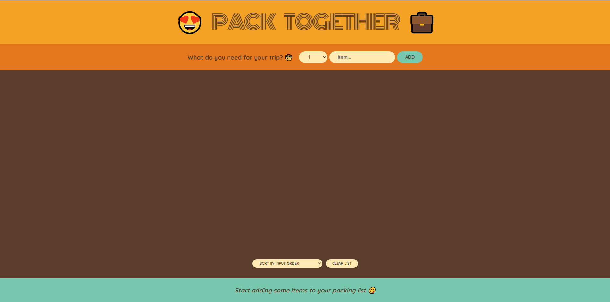
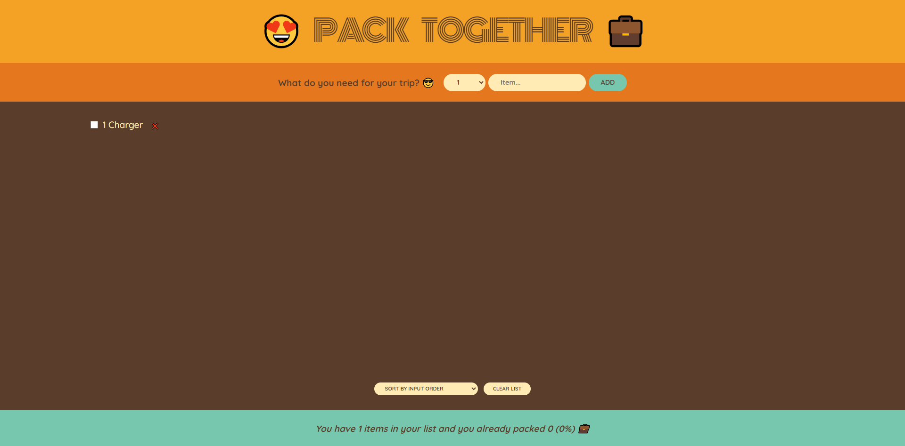
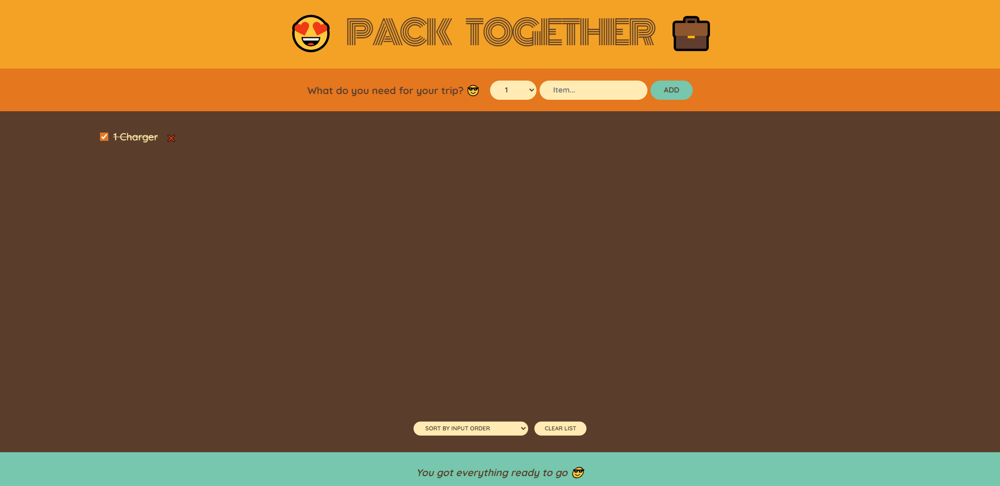

# 😍 Pack Together 💼

Welcome to **Pack Together**, your go-to React app for organizing and managing your packing list! 🧳 Whether you're heading out for a weekend getaway or a grand adventure, this app ensures you won't forget a thing! ✅

---

## 🌟 Key Features

✨ **Add Items**: Quickly jot down what you need to pack.  
✨ **Sort Your List**: Easily organize items by input order, name, or packed status.  
✨ **Mark as Packed**: Cross items off your list once they're ready to go.  
✨ **Edit Your List**: Delete individual items or clear everything for a fresh start.  
✨ **Track Your Progress**: Visualize your packing with handy stats! 📊  

---

## 🏗️ Project Structure

- **`components/`**  
  - `Logo.js`: A welcoming logo component to set the mood. 😍  
- 
  - `Form.js`: A simple form for adding new items to your packing list. ✍️  
  - `PackingList.js`: Displays your organized packing list. 🗂️  
  - `Stats.js`: Shows stats like the number of packed items and progress percentage. 📈  
  - `Item.js`: Handles individual list items (packed or unpacked). ✅  
- **`App.js`**: Brings all components together to form the app. 🏗️  
- **`index.js`**: Entry point for React DOM rendering. 🚀  
- **`index.css`**: Styles the entire app with a modern and clean look. 🎨  

---


## 🔗 Live Demo

👉 **[https://antot-12.github.io/NO](https://antot-12.github.io/Pack-React-Site/)**

---


## 📸 Screenshots

Take a peek at **Pack Together** in action! 🌟

### 🎬 Main View


### 🛒 Adding Items


### 📊 Packed Stats


---

## 🚀 Getting Started

Ready to start packing? Here's how to get **Pack Together** up and running on your local machine. 🖥️

### 🛠️ Prerequisites

Ensure you have **Node.js** and **npm** installed.  

### 📥 Installation

1. Clone the repository:
   ```bash
   git clone https://github.com/Antot-12/Pack-React-Site.git
   
   cd Pack-React-Site

2. Install the required dependencies:
   ```bash
   npm install
   ```

### 🏃‍♂️ Run the App

Start the development server:
```bash
npm start
```
Open [http://localhost:3000](http://localhost:3000) in your browser to view the app.

---

## 💡 How It Works

### Adding an Item ✍️
1. Type in the item name and select the quantity.
2. Click the **Add** button, and voilà, it's on your list!

### Sorting Your List 🔀
Choose how you'd like to view your list:
- **Input Order**: The order you added the items.
- **Description**: Alphabetical order of item names.
- **Packed Status**: Group packed and unpacked items separately.

### Tracking Your Progress 📊
Packed all your items? Enjoy the satisfaction of a 100% packed list! 🎉

---

## 🧩 Component Showcase

Here’s a quick look at the major components used in **Pack Together**:

### `Form.js` 📝
Allows users to add new items to their packing list.

### `PackingList.js` 🗂️
Handles sorting, deleting, and toggling items on your list.

### `Stats.js` 📊
Keeps track of your packing progress and displays motivating stats!

---

## 🤝 Happy Packing! 🎒

We hope **Pack Together** makes your packing easier, faster, and more fun. Enjoy your trip, and don’t forget anything! 😎✈️
